# COLOSSUS

**One fight against a living ruin.** A third-person, Souls-like boss fight in the browser. A lone warrior walks into
a drowned arena at night. Rain hammers the flagstones, lightning cracks over the broken arches, and the rubble in the
middle of the arena rises, stone by stone, into **OSTRAKON, THE LIVING RUIN**: a golem more than eight times your
height that can only be hurt in its glowing cyan cores. One fight, three phases, fair but hard.

**[Play it in your browser](https://colossus-bem.pages.dev/play/)** (free, no install, desktop browser) and see the
**[landing page](https://colossus-bem.pages.dev/)** for gameplay video of every phase and a whole fight, uncut.

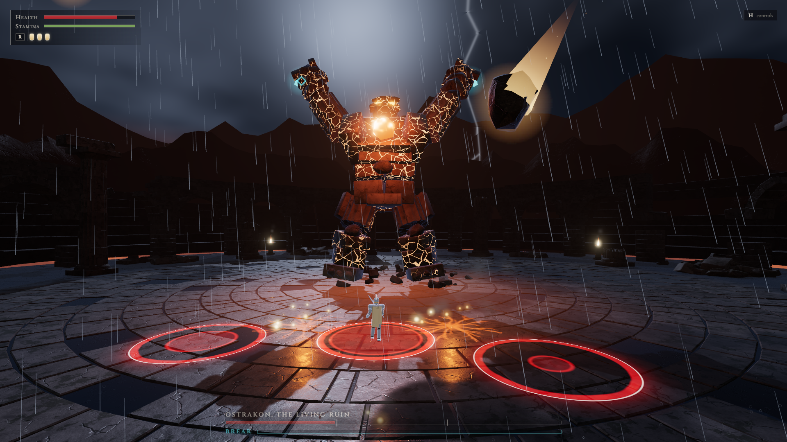

| | |
| --- | --- |
| 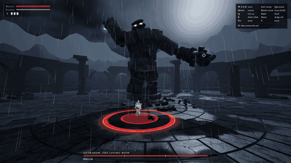 | 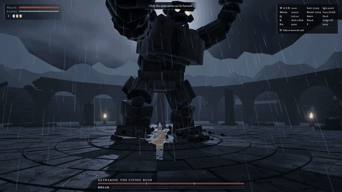 |
| **Strike the core.** After a slam a fist stays stuck in the floor; the cyan core on its forearm is in reach. | **Read the floor.** A pale red band is a shockwave: roll or jump through it. |
| 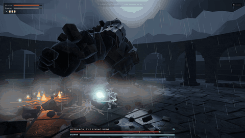 | 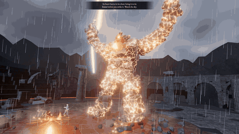 |
| **Break it.** Core hits fill BREAK; when it is full the Ruin falls to its knees and its back core opens. | **Phase III.** At a third of its health its chest bursts open on a white-hot heart. |
| 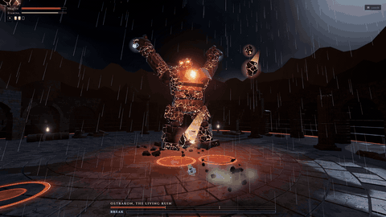 | 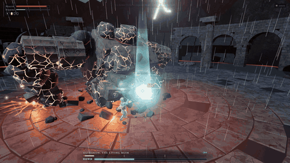 |
| **The sky comes down.** Every landing point is ringed on the floor before the rock arrives. | **Ruin silenced.** It buckles, its fire goes out and the stones fall back into rubble. |

The clips are the finished game, recorded one frame at a time at 60 fps while the test bot played (see
[Footage](#footage)).

---

## Run it

Needs Node.js 20 or newer.

```bash
npm install
npm run dev
```

Then open http://127.0.0.1:5419 (the dev server picks the next free port if that one is taken).

```bash
npm run build      # type-check and build into dist/
npm run preview    # serve the build on http://127.0.0.1:4419
```

## How to fight

Stone deflects your blade. **Only the glowing cyan cores can be hurt**: one on each forearm and one low on its back.

- After a slam or a sweep, a fist stays stuck in the ground. That is your window: strike the arm core (a **STRIKE**
  tag marks it), then get clear before the fist tears free.
- Core hits fill the **BREAK** meter. When it is full the golem falls to its knees: get behind it and hit the core on
  its back (critical damage). While it is down, every hit counts.
- **Phase II** (at two thirds of its health) splits its body with glowing cracks and adds a two-fisted slam with a
  racing fissure, a rock volley and a sweep combo. **Phase III** (at one third) bursts its chest open on a molten
  heart and adds a leaping slam, a double stomp and a meteor rain. The heart can be struck while the golem is down.
- Health is red, stamina green. Attacks, rolls, blocks and jumps spend stamina; with none left you cannot roll or
  block. **R** drinks a flask (three per attempt).

Every attack is drawn on the floor before it lands:

| On the floor | Means |
| --- | --- |
| Red ring, sector or strip | A blow lands here. Get out. |
| Pale red band | A shockwave. Roll or jump through it. |
| Amber cracks | Burning ground. Step off. |
| Cyan | A core. Strike it. |

The death screen names what killed you and how to beat it; **Try again** puts you straight back in the fight. A
player who learns the tells should win within three to six attempts.

## Controls

| Action | Keyboard and mouse | Gamepad |
| --- | --- | --- |
| Move | W A S D | Left stick |
| Camera | Mouse (click the game to capture it) | Right stick |
| Light attack (3-hit combo) | Left click | RB / R1 |
| Heavy attack (hold to charge) | Right click | RT / R2 |
| Block (hold) | Shift | LB / L1 |
| Dodge roll (briefly invulnerable) | Space | B / Circle |
| Jump | F | A / Cross |
| Lock on / off | Q, Tab or middle click | R3 |
| Drink a flask | R | X / Square |
| Pause | Esc or P | Start |
| Show or hide the controls card | H | |

Every action is buffered: press it during another action and it fires as soon as it can. **Settings** (on the title
screen or the pause menu) has mouse sensitivity, invert Y, master, music and effects volume, camera shake and the
controls card. Settings are remembered in the browser.

## Screenshots

Full-HD frames from the player's camera, taken from the final build by `npm run playtest -- --scenario final`.

| | |
| --- | --- |
| 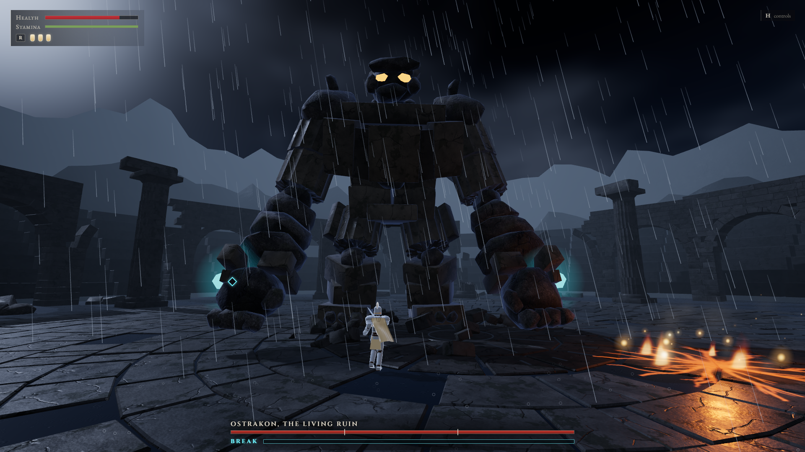 | 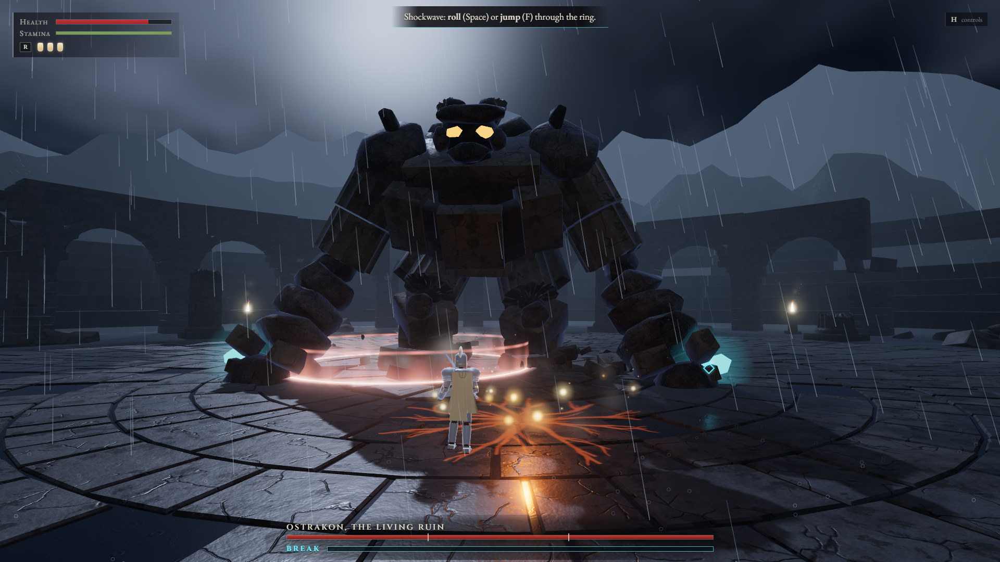 |
| 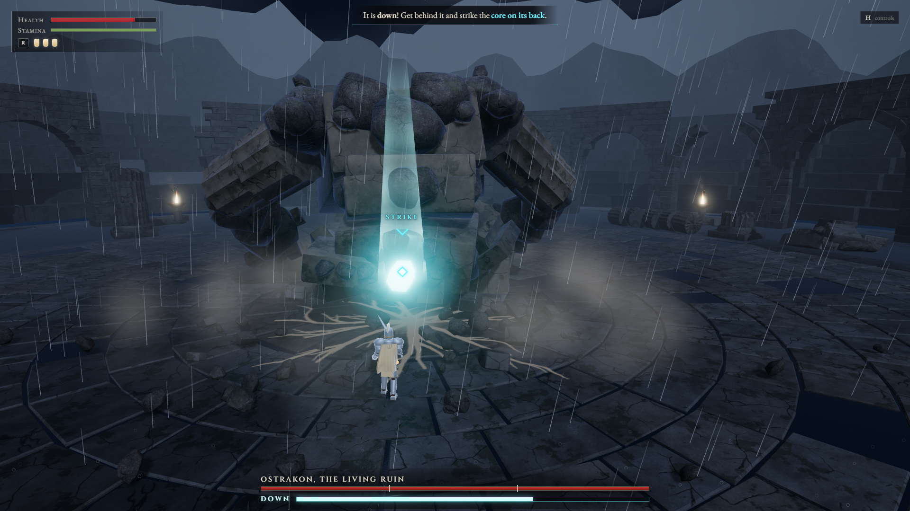 | 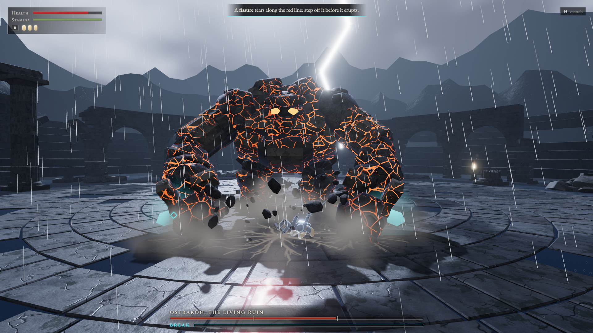 |
|  | 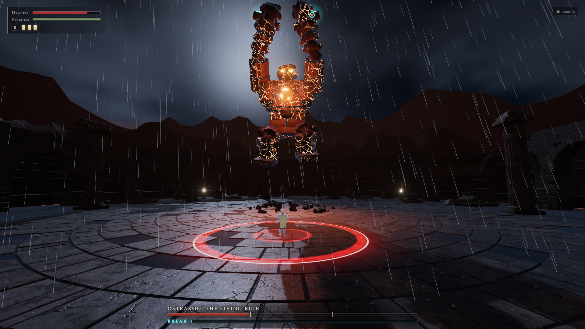 |

---

## How it was made

COLOSSUS was built by Claude (Opus 5.5) from a single prompt, the fourth game in a series of one-shot builds.
Nothing was downloaded:

- **Models:** six Blender Python scripts in `blender_scripts/`, one per asset family (golem, warrior, arena, pillars,
  rubble, textures), run through the Blender MCP and exported as Draco-compressed glTF (about 2 MB in all). The
  golem is about 126 bone-parented stone pieces, so it can assemble itself from rubble and fall apart again.
- **Textures:** baked in Blender from 4D noise on a torus (so they tile seamlessly), or drawn in shaders.
- **Sound and music:** synthesized live with the Web Audio API: impacts, stone, rain, thunder and a layered score
  that changes with each phase.
- **Animation:** procedural poses driven by `public/balance.json`, so every timing change keeps animation and hit
  boxes in sync; two-bone IK puts the golem's fists exactly on their telegraphed targets.

It was built in five milestones, each closed by a self-test loop: a Playwright script played the game with scripted
input and saved screenshots from the player's camera, then a separate critic that saw only those screenshots and the
pitch, never the code, listed the five worst problems. They were fixed and the loop ran again. Every report and what
was fixed after it is in [`docs/critic/`](docs/critic).

| Milestone | Critic rounds |
| --- | --- |
| 1. Greybox: the whole fight in primitive shapes | 16 |
| 2. Assets: every model built by Blender script | 16 |
| 3. Feel: animation, camera, hit feedback, weather, sound | 12 |
| 4. Interface: title, HUD, pause, death and victory screens | 5 |
| 5. Polish and perf: 60 fps, balance, zero console errors | final checks |

## Performance

The game aims for 60 fps on a mid-range laptop. An adaptive quality governor watches the frame time: after a few
seconds above about 19.5 ms it lowers the render scale (and then the shadow resolution), and it raises them again after
a long fast stretch. Add `?quality=low`, `?quality=medium` or `?quality=high` to the URL to pin a level, and `?fps=1`
to show the frame time. Every shader is compiled behind the loading screen, so the first stagger or phase change never
stalls.

## Tuning

`public/balance.json` holds every damage, health and timing value. Edit it and reload the page (in a build, edit
`dist/balance.json`); no code changes are needed. With the shipped values the "decent" test bot wins about 3 attempts
in 10, most losses coming late in phase III.

## Tests

`npm run playtest -- --scenario <name>` starts the game in headless Chromium, plays it with real keyboard and mouse
input (or the in-page bot for long fights), and writes screenshots, the console log and `report.json` to
`test-output/`.

| Scenario | What it does |
| --- | --- |
| `smoke` | Real input through the title, the intro and every control |
| `win` | The expert bot (invulnerable) fights to the victory screen |
| `lose` | A death, the death screen, then Try again |
| `perf` | Frame times and draw calls over 20 s of fighting |
| `critic` | 19 player-camera screenshots of every beat (the milestone 1 and 2 critic set) |
| `feelcritic` | Frame bursts around hits, impacts and weather, frozen per frame (milestone 3) |
| `uicritic` | Every menu, HUD state and end screen (milestone 4) |
| `final` | The six full-HD screenshots in `screenshots/` |

```bash
npm run balance -- --runs 10    # the "decent" bot fights 10 full attempts, no invulnerability
```

## Footage

The landing page's clips and the GIFs above come from **film mode** (`scripts/film.mjs`). It replaces the page's
`requestAnimationFrame` and `performance.now` with a virtual clock, then steps the game one 1/60 s frame at a time and
pipes every captured frame into ffmpeg. A 1080p capture runs well below real time, but the game never sees that, so
the footage is a smooth 60 fps. Every notable game event (a core hit, a stagger, a phase change) is saved with its
frame number, and `scripts/make-media.mjs` cuts each clip at its event, so a new recording re-cuts itself.

```bash
npm run film -- --shoot intro          # the title and the intro, no HUD (the landing page's scroll-scrubbed hero)
npm run film -- --shoot fight --nobuild
npm run film -- --shoot lose --nobuild
npm run film -- --shoot showcase --nobuild   # beats the bot never plays: a combo on the stone shin (deflects)
npm run media                          # clips, posters, scrub frames, chapters.json, README GIFs
```

The encoder is `ffmpeg-static` from npm; if your npm blocks install scripts, run `npm approve-scripts ffmpeg-static`
once.

## The public site

`site/` is the landing page (static HTML, CSS and JS; its media in `site/media/`). `npm run site` builds `site-dist/`
with the landing page at `/` and the game, built with base `/play/`, at `/play/`. `npm run site -- --deploy` also
deploys it to Cloudflare Pages (project `colossus`, https://colossus-bem.pages.dev). Pages ignores byte-range
requests, so the page downloads the whole-fight video into a local blob before seeking into it (the short clips only
loop and need no seeking). `node scripts/shot-site.mjs [url]` screenshots the page at fixed scroll points for review.

## Assets

`npm run assets` regenerates every model and texture with Blender 5.x in background mode (set `BLENDER_PATH` if
Blender is not at the default path). See `CLAUDE.md` for the asset list, the pipeline and the decisions log.

## Project layout

```
src/game          the fight: flow and director, golem AI and attacks, the player, threats (rings, rocks, fissures)
src/render        camera framing, effects and particles, telegraphs, materials, weather, the quality governor
src/anim          the pose system, rigs, IK, golem and warrior poses
src/audio         synthesized sound effects and the phase-layered score
src/ui            HUD, menus and screens, styles
src/debug         test hooks and the in-page bot
blender_scripts/  one Python script per asset family (plus shared helpers)
public/           exported .glb models, baked textures, balance.json
site/             the landing page and its media
scripts/          playtest, film, make-media, build-site, build-assets and probes
docs/critic/      every critic report and what was fixed after it
docs/media/       the README GIFs
screenshots/      six final full-HD player-view screenshots
```

## Licence

The game code and assets in this repository were made for this project. Cinzel and EB Garamond are licensed under
the SIL Open Font License 1.1 and bundled from npm (`@fontsource`).
